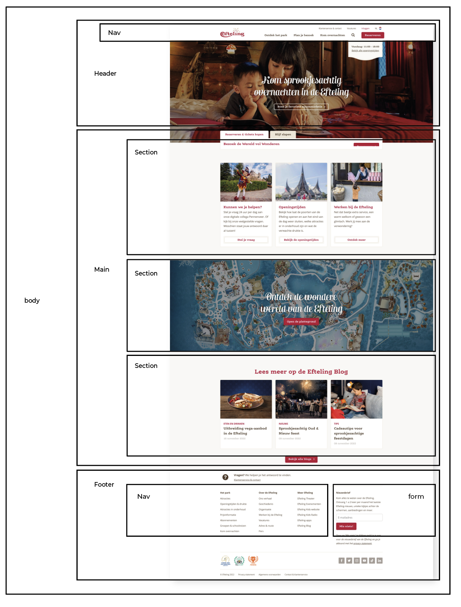
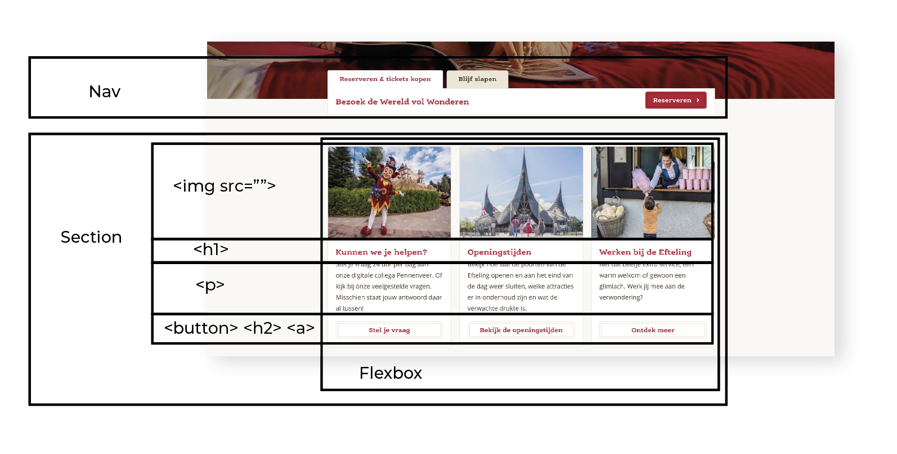

# Procesverslag
[Hulp bij het schrijven van Markdown](https://github.com/adam-p/markdown-here/wiki/Markdown-Cheatsheet)

# Inleiding
Voor het vak frontend development gaan we individueel aan de slag met een opdracht waarbij wij een website dieal betat 'opnieuw' in elkaar gaan zetten door middel van HTML en CSS.

# intake
Voor het begin van de eerste les zijn er een aantal zaken waarnaar wij gaan kijken zoals, welke pieste ik gabewandelen. Ik ga voor de blauwe piesten omdat ik html en css nog altijd lastig vind.

## Jij

  
uitwerken voor kick-off werkgroep

  ### Auteur:
  Isa van Vliet

  #### Je startniveau:
  Start niveau piste blauw

  #### Je focus:
  Responsive
 

## Je website

  
uitwerken voor kick-off werkgroep

  ### Je opdracht:
  (https://www.efteling.com/nl?gclid=CjwKCAiAjs2bBhACEiwALTBWZVjixDNjERkkpaWZPivP4gKIKXmr3qFZk3fQ2wAYtu2pJLnIXA83PxoCkHYQAvD_BwE)

  De website die ik onderhande ga nemen is de website van de efteling. De website is erg simpel en ik wil er meer uithalen.

# De Efteling

  #### Screenshot(s) van de eerste pagina (small screen): 
  Wanneer je de website opend van de efetling is dit de beginpagina. 
  

  #### Screenshot(s) van de tweede pagina (small screen):
  hier de naam van de pagina  
  
 

## Toegankelijkheidstest 1/2 (week 1)

  
uitwerken na test in 1e werkgroep

  ### Bevindingen
  Lijst met je bevindingen die in de test naar voren kwamen:
  - dark mode(?)

  #### Screenreader
  Tijdens het doen van de screenreader op de website van de efteling waren een aantal afbeeldingen die geen <alt> tekst hadden. Op deze manier kan iemand die blind/slechtziend de website minder goed begrijpen. Ook de pagina waarbij de winter efteling wordt aangekondigt is er een overlay van vallend sneeuw waardoor de screenreader de hele pagina niet kan voorlezen.  

  Dit kan makkelijk opgelost worden door het element een </alt> tekst te geven.

  #### Muis en Toetsenbord 
  Tijdens het doen van de screenreader ben ik aan de slag gegaan met de tab-toets. Nu ga ik nog een keer met de tab-toets door de website maar dan zonder screenreader. Het viel mij gelijk op dat sommige elementen geen html elementen zijn en niet worden gelezen door de tab toets. Hierdoor zou iemand die blind/slechtziend is belangrijke knoppen/informatie missen.

  Hier een omschrijving van hoe het opgelost kan worden (met indien nodig afbeeldingen)

  #### Motoriek (shocks, elastiekjes)
  Tijdens het testen van de inclusiviteit van de website heeft mijn testpersoon een aantal elestiekjes gbonden om haar vingers waardoor het navigeren door de website een stukje lastiger wordt.
  

  Hier een omschrijving van hoe het opgelost kan worden (met indien nodig afbeeldingen)

  #### Visueel (brillen, contrast, kleurenblind, dark/light). 
  Hier korte omschrijving (met indien nodig afbeeldingen)
  
  

  Hier een omschrijving van hoe het opgelost kan worden (met indien nodig afbeeldingen)

## Breakdownschets (week 1)

uitwerken na afloop 2e werkgroep

  ### de hele pagina: 
  

  ### dynamisch deel (bijv menu): 
  

## Voortgang 1 (week 2)

  
uitwerken voor 1e voortgang

  ### Stand van zaken
  Mijn eerste pagina begint eindelijk ergens op te lijken. Ik loop wel nog erg vast op het maken van een mooi werkend menu. Hiervoor heb ik hup gevraagd bij Ymaro.

  ### Agenda voor meeting
  samen met je groepje opstellen

  | Sam            | Isa                | Noah         | Aleid            |
  | ---            | ---                | ---          | ---              |
  | Meer weten over| menu maken met java| -            | heleboel punten  |
  | afbeeldingen   |                    |              |                  |
  | naast elkaar   |                    |              |                  |
    zetten

  ### Verslag van meeting
  hier na afloop snel de uitkomsten van de meeting vastleggen

  Iedereen is al goed op weg. De vragen gingen vooral over kleine detials en we werden goed geholpen door ymaro. Mijn menu hebben we werkend gekregen en ook de ijspegels 'hangen' nu op de juiste plek.

## Voortgang 2 (week 3)

  
uitwerken voor 2e voortgang

  ### Stand van zaken
  Deze week heb ik compleet mijn navigatie opnieuw opgezet. Hiervoor heb ik een nieuwe html gemaakt en ben ik al eerste de navigatie gaan maken. 

  Door opnieuw te beginnen is het mij eindelijk gelukt om met java script een bewegend menu te maken. 
  
  Ik ben deze week ook begonnen met het opmaken van een footer. In mij footer wil ik graag een form plaatsen maar hiermee heb ik nog nooit gewerkt. Ik heb al een kleine opzet gemaakt maar ik ga dit verder vragen tijdens het voortgangs gesprek.

  ### Agenda voor meeting
  samen met je groepje opstellen

  | Isa            | Alexia             | Aleid              | Sam               |
  | ---            | ---                | ---                | ---               |
  | forms in footer| menu met javascript| Position absolute  | Menu en javascript|
  |                |                    | en nog een aantal  |                   |
  |                |                    | vragen             |                   |

  ### Verslag van meeting
  Ik heb meegegeken naar hoe Vasilis heeft geholpen met het opmaken van het menu bij alexia. Dit heeft mij opnieuwe ideeën gebracht en kan ik weer toepassen bij mijn eigen webzite. Door dit samen te bespreken heb ik het idee dat ik het meer ben gaan begrijpen. Ik kan nu zelf elementen bedenken die ik zou kunnen toepassen op een website waar ik 3 weken geleden nog nooit van had gehoord.

## Toegankelijkheidstest 2/2 (week 4)

  
uitwerken na test in 8e werkgroep

  ### Bevindingen
  De toegangkelijkheidstest wordt afgenomen door mijn moeder. Het was belangrijk voor mij om deze keer iemand het te laten testen die nog geen weet had van de opdracht.

  #### Screenreader
  Voor de test had ik nog geen aria labels toegevoegd aan de buttons die alleen bestonden uit een afbeelding. Deze waren dus niet leesbaar voor de screenreader en dus ook niet voor slechtziende.

  Dir was snel op te lossen door alle buttons die alleen uit een img bestonden een aria-label="met naam van button" zodat de screenreader dan dit label zal voorlezen.

  #### Muis en Toetsenbord 
  Met de tab beweeg je gemakkelijk door alle buttons die op de website aanwezig zijn.

  #### Motoriek (shocks, elastiekjes)
  Tijdens deze test kwam ik er achter at een paar buttons te klein waren en heb ik deze vergroot om er zo emakkelijker op te kunnen drukken.

  #### Visueel (brillen, contrast, kleurenblind, dark/light). 
  Mijn website heeft van zichzelf al een groot contrast door het gebruik van donkere achtergrond met witte tekst. Hierdoor blijft alles goed leesbaar.

## Voortgang 3 (week 4)

  
uitwerken voor 3e voortgang

  ### Stand van zaken
  Dit voortgangsgesprek hebben we samen met Vasilis vooral gefoccused op het afronden en het stellen van de laatste vragen. Ik had bijvoorbeeld het probleem dat de @media niet werkte.

  ### Verslag van meeting
  Het probleem van de @media hebben we verholpen door een grotere width te geven. Ik had deze op 40em gezet maar dit was te klein. Toen ik 100em had aangegeven deed hij het wel!

## Eindgesprek (week 5)

  
uitwerken voor eindgesprek

  ### Je uitkomst - karakteristiek screenshots:
  
  
   
   
   
   

  ### Dit ging goed/Heb ik geleerd: 
  Ik heb heel veel geleerd over html en CSS binnnen 5 weken. Ik heb echt het idee dat ik het begrijp en vond het op een gegeven moment ook leuker om er aan te werken. Als een stukje code dan ineens werkte voelde het echt alsof je een moeielijke wiskunde so had opgelost. Ik ben bij 1 gestart en geef mijn kennis hierover nu wel een goeie 7! De annimaties waren nog een redelijke uitdaging omdat je daar heel scherp moet zijn of je echt niks bent vergeten. Ik heb grotendeel responsive design voorop gesteld. Dit is grote deels gelukt.

  

  ### Dit was lastig/Is niet gelukt:
  De footer mken vond ik lastig omdat deze niet mooi responsive is geworden. Ik heb veel geprobeerd maar sommige vormgeving is lastig te schalen met een @media zonder dat het er raar uit ziet. De website is wel responsive maar het had nog mooier kunnen zijn als ik hier nog meer tijd voor had genomen.

  

## Bronnenlijst

  
continu bijhouden terwijl je werkt

  1. https://developer.mozilla.org/en-US/docs/Web/HTML/Element/nav
  2. https://www.internetingishard.com/html-and-css/forms/
  3. https://www.w3schools.com/css/css_navbar.asp
  4. https://www.w3schools.com/html/html_forms.asp

